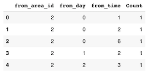
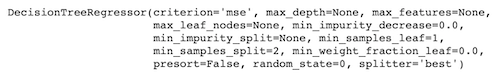
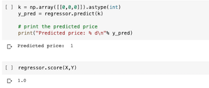

# Taxi surge predictor.Data Encoding

### Data Cleaning and Encoding

Primary task in this project revolved aorud data cleansing and making normal data function according to the model.
This project required Area code, Month, Day and Time code.

#### Encoding
    ---
    Area: 0,1,2...
    Day of the week: 0 -> Monday, 1 -> Tuesday,...
    Time: 0 -> 12 am to 1 am, 1 -> 1 am to 2 am,...
    Count: Number of taxi requests coded as 1, 2, 3...
    ---


<div class="caption">
    Area, Day, Time and Count encoding
</div>

#### Using Decision tree Regressors
Decision tree Regressors are best explained by Georgios Drakos at his Medium Blog [Decision Tree Regressor explained in depth](https://gdcoder.com/decision-tree-regressor-explained-in-depth/).

I used Scikit's Decision Tree Regressor to complete this task. Information about this can be found at their [documentation](https://scikit-learn.org/stable/modules/generated/sklearn.tree.DecisionTreeRegressor.html).


```python 
from sklearn.tree import DecisionTreeRegressor 
```


<div class="caption">
    Decision tree from sklearn.tree.DecisionTreeRegressor
</div>

Using this Decision tree for my data, I get a score of 1.0. the result is predicted for an input of [0,0,0].


<div class="caption">
    Model Prediction on [0,0,0]
</div>